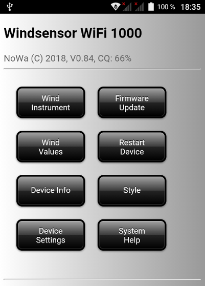

## The Windsensor WiFi 1000 is a OpenSource project to build windsensor for sailboats with 3D printer parts and a ESP8266

My windsensor was defect in the last winter time 2018 by a big storm in Netherlands. I needed a new windsensor for my small sailboat. It is a Dehlya 22. I seached a interesting and usefully project for my new 3D printer. At first I try to build the hemispheric parts and the rotor. After successfully 3D printing I was amazed about the good quality and mechanical precision. My printer is a low cost Chinise model JGAurora in prusa design. At this point I started my project with the windsensor and I designed all parts in 3D for my printer.

For designing i take the online CAD program [Onshape](https://www.onshape.com). It is easy, powerfull and innovative. You only need a PC and a web browser with 3D function (Web GL). You find my project under the term "windsensor". Copy it in your own work place and you can view and modify the 3D model.

The windsensor based on a [patent](Patents/US5231876.pdf) from PeetBros Inc. The patent has expired and everyone can use it. The function is very simple and use two reed magnet sensors for wind speed and wind direction. I modified the circuit and changed the sensors to two hall sensors. A ESP8266-E12 measure two time values from both sensors and calculate the wind speed and wind direction.The operating principle is very simple and tricky. It is a perfect solution of simplicity and function and a good base for the ESP8266.

For a first impression see the videos:

[Live Windsensor](https://www.youtube.com/watch?v=ME7WqSQ8mfY) 

[Display data in OpenPlotter](https://www.youtube.com/watch?v=0nfqlGNmgYI) 

I bublished the project in the german sail forum [www.segeln-forum.de](https://www.segeln-forum.de/board1-rund-ums-segeln/board35-bootstechnik-und-elektronik/67401-windsensor-diy/) and found a lot of interested poeple. Afte a half year was all mechanical components and elektrical shematics finished and I could try the first windsensor successfully on my sailboat.

## These are my conditions for the new windsensor:

* Measuring from wind speed and wind direction
* Robust mechanics
* Weight < 200g
* Small enought for a 22 feed sailboat
* Weatherproof and UV stable
* Visible by night
* No cabeling for sensor signals
* Only digital signal transmission with WiFi
* 12V power supplay from top light
* Using a ESP8266 for WiFi and data handling
* Update rate app. 1...2 samples per second
* No onboard instrument necessary
* Visualitation in OpenPlotter via laptop, mobile fone or tablett
* No software installation unnecessary (display is the browser)
* Supported protocol NMEA 0183
* Price < 250 Euro

## How can I use it?

I use the windsensor in combination with [OpenPlotter](http://www.sailoog.com/openplotter) on a Rasiberry Pi 3B. OpenPlotter is a access point for WiFi devices. The windsensor connects via WiFi with OpenPlotter and send the NMEA0183 data telegrams each second. The windsensor sends 4 types of telegrams. 3 standard telegrams (MWV, VWR, VPW) and one custom telegram (INF). Under following [link](http://www.nmea.de/nmea0183datensaetze.html) you find more informations about NMEA0183. 

It is possible with each network device connect to OpenPlotter. A simple browser shows all data from the windsensor. I use a small 7" Android tablet as display for my windsensor.

(2018-11-02) Now is a Android App available. The App is a WebApp and connect direct the webserver in the windsensor for displaying all data.

## What is the current status?

At the moment we could finish a lot of points but not all is perfect or finished.

- [x] Technical recherche
- [x] Evaluation of function
    - [x] Hall sensors
    - [x] Magnets
    - [x] Proto type circuit
    - [x] Test software
    - [x] Web display technologies
    - [x] 3D material test
    - [x] Coating tests
- [x] Mechanical design
    - [x] 3D parts
    - [x] Turning parts
- [x] Electronic design
    - [x] Circuit design
    - [x] Board design
    - [x] Customer sample circuit
- [x] Software
    - [x] Basis funktionality
    - [x] NMEA0183 WiFi
    - [x] NMEA0183 Serial
    - [x] JSON
    - [x] Web-Updater
    - [x] Web-Configurator
    - [x] Web server as data display
    - [x] Andoid App
- [x] Components ordering
    - [x] Electronic board
    - [x] Mechanical parts
    - [x] Turning parts
    - [x] Fittings
- [x] Prototyp creation
    - [x] White prototype
    - [x] Black prototype
- [x] Production Zero series
    - [x] DIY Kits
    - [x] Assembled windsensor
- [x] Shipping Zero Series
- [ ] Documentation
    - [x] Technical description
    - [x] Construction manual
    - [x] Part list
    - [ ] User manual
    - [x] Data sheet
- [ ] Application tests
    - [x] Temperature 20...80°C
    - [x] Vibration test by strong wind (5bft)
    - [x] WiFi stability test
    - [x] Connection test
    - [x] Rain test
    - [ ] IPX6 Water resistance test
    - [x] UV radiation test
    - [x] Long time test
    - [ ] Test with auto pilot
    - [ ] User experiences
- [ ] Certification
    - [ ] CE Certification

## Questions?

You have questions or suggestions then you can contact me via email under norbert-walter(at)web.de.