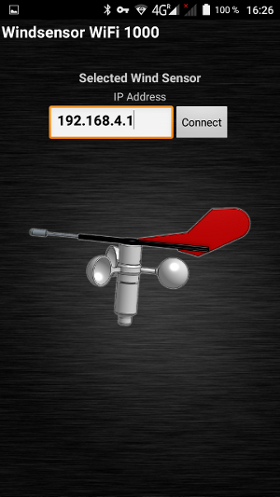

## The Windsensor WiFi 1000 is an OpenSource project to build a wind transducer for sailboats using 3D printer parts and an ESP8266 microcontroller

My wind transducer got damaged in winter 2017/2018 by a big storm in Netherlands. I needed a new transducer for my small sailboat. It is a Dehlya 22. At the same time I was looking for an interesting and useful project for my new 3D printer. At first I tried to build the hemispheric parts and the rotor. After successful 3D printing I was amazed about the good quality and mechanical precision. My printer is a low cost Chinese model JGAurora in prusa design. At this point I started my project with the windsensor and I designed all parts in 3D for my printer.

For designing I use the online CAD program [Onshape](https://www.onshape.com). It is easy, powerfull and innovative. You just need a PC and a web browser with 3D function (Web GL). You find my project under the term "windsensor". Copy it to your own workplace so you can view and modify the 3D model.

This windsensor is based on a [patent](Patents/US5231876.pdf) from Peet Bros Inc. The patent has expired and everyone can use it. The function is very simple using two reed magnet sensors to detect wind speed and wind direction.

I modified the circuit and used two hall sensors instead. An ESP8266-E12 microcontroller processes readings from both sensors and calculates wind speed and wind direction. The operating principle is amazingly simple and smart. It is a perfect combination of simplicity and effectiveness and poses an attractive task for the ESP8266 microcontroller.

If you like to help or consider this project useful, please donate. Thanks for your support!

[Donate with PayPal](https://www.paypal.com/cgi-bin/webscr?cmd=_s-xclick&hosted_button_id=5QZJZBM252F2L)

For a first impression see the videos:

[Live Windsensor](https://www.youtube.com/watch?v=ME7WqSQ8mfY) 

[Display data in OpenPlotter](https://www.youtube.com/watch?v=0nfqlGNmgYI) 

I published and discussed this project in the German sailing forum [www.segeln-forum.de](https://www.segeln-forum.de/board1-rund-ums-segeln/board35-bootstechnik-und-elektronik/67401-windsensor-diy/) and found many interested people. Half a year later, all mechanical components and electrical schematics were completed and I successfully launched the first windsensor on my sailboat.

## These were the initial requirements for the new windsensor:

* Measuring wind speed and wind direction
* Robust mechanics
* Weight < 200g
* Small enough for a 22 feet sailboat
* Weatherproof and UV stable
* Visible by night
* No cabling for sensor signals
* Digital signal transmission with WiFi only
* 12V power supply utilizing top light power cable
* Using a ESP8266 for WiFi and data handling
* Update rate approx. 1...2 samples per second
* No onboard instrument required
* Visualisation in OpenPlotter via laptop, mobile fone or tablett
* No extra software required (display is the browser)
* Supporting  NMEA 0183 protocol
* Price < 250 Euro

## How can I use it?

I use the windsensor in combination with [OpenPlotter](http://www.sailoog.com/openplotter) on a Raspberry Pi 3B. OpenPlotter serves as access point for WiFi devices. The windsensor connects to OpenPlotter via WiFi and transmits the NMEA0183 data telegrams every second. The windsensor sends 4 types of telegrams. 3 standard telegrams (MWV, VWR, VPW) and one custom telegram (INF). Check here [link](http://www.nmea.de/nmea0183datensaetze.html) for more information on NMEA0183. 

Network devices can be connected to OpenPlotter. A simple browser displays all data from the wind transducer. I use a 7" Android tablet as display for my windsensor.

(2018-11-02) Now also available as Android App. It is is a WebApp connecting directly to the windsensor to display all data.

## What is the current status?

I have completed many tasks but still not everything is perfect so far.

- [x] Technical recherche
- [x] Evaluation of function
    - [x] Hall sensors
    - [x] Magnets
    - [x] Prototype circuit
    - [x] Test software
    - [x] Web display technologies
    - [x] 3D material test
    - [x] Coating tests
- [x] Mechanical design
    - [x] 3D parts
    - [x] Turning parts
- [x] Electronic design
    - [x] Circuit design
    - [x] Board design
    - [x] Customer sample circuit
- [x] Software
    - [x] Basic functionality
    - [x] NMEA0183 WiFi
    - [x] NMEA0183 Serial
    - [x] JSON
    - [ ] MQTT
    - [ ] Wind History Diagram
    - [x] Sensor Data Diagram for diagnostic and mechanical adjustment
    - [x] Web-Updater
    - [x] Web-Configurator
    - [x] Web server as data display
    - [x] Andoid App
    - [x] External Diagnostic Tool
- [x] Components ordering
    - [x] Electronic board
    - [x] Mechanical parts
    - [x] Turning parts
    - [x] Fittings
- [x] Prototyp creation
    - [x] White prototype
    - [x] Black prototype
- [x] Production Zero series
    - [x] DIY Kits
    - [x] Assembled windsensor
- [x] Shipping Zero Series
- [ ] Documentation
    - [x] Technical description
    - [x] Construction manual
    - [x] Part list
    - [ ] User manual
    - [x] Data sheet
- [ ] Application tests
    - [x] Temperature 20...80°C
    - [x] Vibration test by strong wind (5bft)
    - [x] WiFi stability test
    - [x] Connection test
    - [x] Rain test
    - [ ] IPX6 Water resistance test
    - [x] UV radiation test
    - [x] Long time test
    - [ ] Test with auto pilot
    - [x] User experiences
- [ ] Certification
    - [ ] CE Certification

## Questions?

For questions or suggestions please get in contact via email at norbert-walter(at)web.de.
